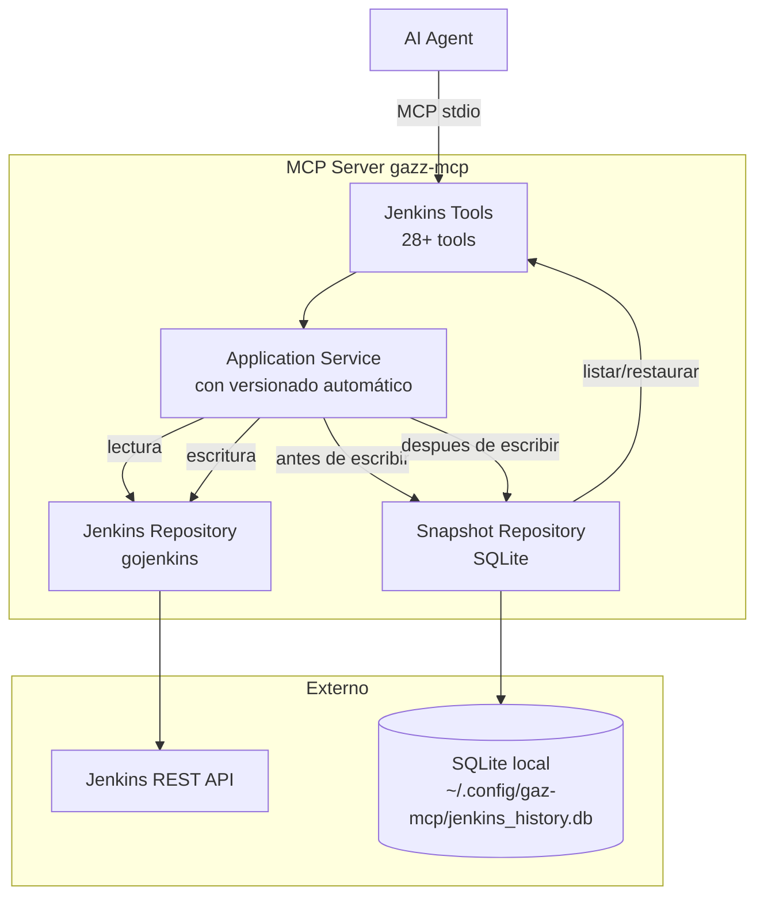
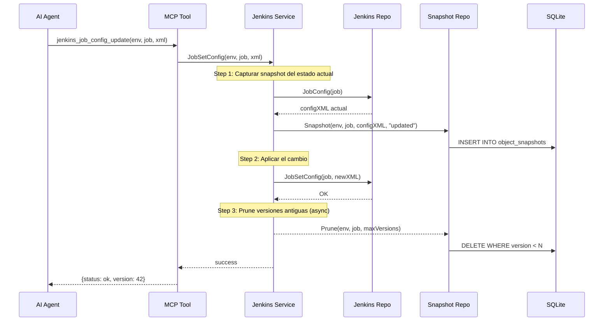
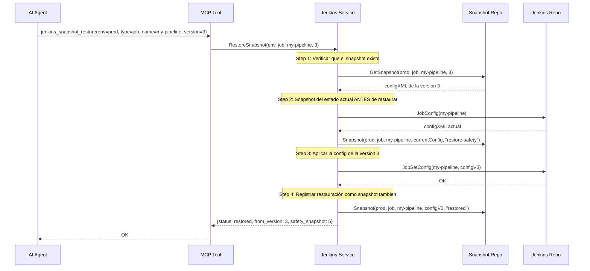

# Plan: Jenkins MCP Proxy para gaz-mcp

## 1. Resumen

Extender `gaz-mcp` para que funcione como proxy MCP de **lectura/escritura/ejecución** sobre la API REST completa de Jenkins, siguiendo la misma arquitectura hexagonal del proxy SQL existente. La API key de Jenkins se oculta siguiendo el mismo patrón de Viper + env vars.

### Novedad: Sistema de backup/versionado automático

Cada vez que un agente AI modifique un objeto de Jenkins (job, vista, nodo, credencial, folder), el proxy **automaticamente captura un snapshot del estado anterior** antes de aplicar el cambio. El agente puede listar versiones, ver diffs y restaurar cualquier versión previa. El almacenamiento usa **SQLite embebido** (sin dependencias externas), manteniendo el binario autónomo.

---

## 2. Arquitectura

### Capas (mismo patrón que SQL)

```text
cmd/server/main.go  (recibe JenkinsEnvironments + SnapshotConfig)
    │
    ▼
platform/di/container.go  (nuevos: dominio Jenkins + versionado)
    │
    ├── mcp/domain/jenkins/          ← puerto dominio (interfaces + tipos)
    ├── mcp/application/jenkins/     ← casos de uso + versionado automático
    ├── platform/mcp/jenkins/        ← adaptador Jenkins (gojenkins)
    ├── platform/mcp/tools/          ← herramientas MCP (jenkins_*.go)
    ├── platform/mcp/snapshot/       ← adaptador SQLite para snapshots
    └── shared/config/domain/        ← JenkinsEnvironmentConfig + SnapshotConfig
```

### Dependencias externas nuevas

| Dependencia | Propósito |
|-------------|-----------|
| `github.com/bndr/gojenkins v1.2.0` | Cliente Jenkins REST API |
| `modernc.org/sqlite` | SQLite embebido puro Go (sin CGo, sin C library) |

### Diagrama de flujo completo



### Flujo de una operación de escritura con versionado



---

## 3. Configuración

### Nuevos tipos en `shared/config/domain/`

```go
type JenkinsEnvironmentConfig struct {
    URL      string        // ej: https://jenkins.example.com
    User     string
    APIKey   string        // se omite en logs y marshaling
    Timeout  time.Duration
    Insecure bool          // self-signed certs
}

type SnapshotConfig struct {
    Enabled     bool   // default: true
    DBPath      string // default: ~/.config/gaz-mcp/jenkins_history.db
    MaxVersions int    // default: 50, 0 = unlimited
    AutoPrune   bool   // default: true
}
```

**Protección de API Key:**
- `APIKey` tiene `MarshalJSON()` custom que retorna `"****"`.
- El `String()` la omite. No se loggea en ningún punto.
- Se lee vía Viper desde config YAML o env var `JENKINS_[ENV]_API_KEY`.

### Ampliación de `shared/config/domain/repository.go`

```go
type Repository interface {
    Environments() map[string]EnvironmentConfig
    OpenAIProviderConfig() aiDomain.ProviderConfig
    ServiceConfig() ServiceConfig
    JenkinsEnvironments() map[string]JenkinsEnvironmentConfig  // nuevo
    SnapshotConfig() SnapshotConfig                             // nuevo
}
```

### Config YAML (`config.yaml`)

```yaml
service:
  transport: stdio
  version: 0.3.0

jenkins:
  production:
    url: https://jenkins.example.com
    user: admin
    api_key: "${JENKINS_PROD_API_KEY}"
    timeout: 30s
    insecure: false
  staging:
    url: https://jenkins-staging.example.com
    user: admin
    api_key: "${JENKINS_STAGING_API_KEY}"
    timeout: 30s
    insecure: true

snapshot:
  enabled: true
  db_path: ~/.config/gaz-mcp/jenkins_history.db
  max_versions: 50
  auto_prune: true

# ... secciones existentes: environments, openai ...
```

---

## 4. MCP Tools Propuestas

### 4.1 Información General

| Tool | Descripción | R/W |
|------|-------------|-----|
| `jenkins_info` | Versión, uptime, #jobs, #nodes, modo quiet, #snapshots | R |
| `jenkins_quiet_down` | Poner Jenkins en modo quiet (pausa builds) | W |
| `jenkins_cancel_quiet_down` | Cancelar modo quiet | W |

### 4.2 Jobs

| Tool | Descripción | R/W/X |
|------|-------------|-------|
| `jenkins_job_list` | Listar jobs con filtros (nombre, estado, folder) | R |
| `jenkins_job_get` | Detalle de un job (últimos builds, salud) | R |
| `jenkins_job_create` | Crear job desde config XML + nombre | W |
| `jenkins_job_copy` | Copiar un job existente con nuevo nombre | W |
| `jenkins_job_delete` | Eliminar un job | W |
| `jenkins_job_config_get` | Obtener config.xml de un job | R |
| `jenkins_job_config_update` | Actualizar config.xml de un job | W |
| `jenkins_job_enable` | Habilitar un job | W |
| `jenkins_job_disable` | Deshabilitar un job | W |
| `jenkins_job_build` | Disparar build | X |
| `jenkins_job_build_with_params` | Disparar build con parámetros key=value | X |

### 4.3 Builds

| Tool | Descripción | R/W/X |
|------|-------------|-------|
| `jenkins_build_info` | Info detallada de un build | R |
| `jenkins_build_log` | Log de consola de un build (con paginación) | R |
| `jenkins_build_log_progressive` | Stream progresivo del log de un build en ejecución | R |
| `jenkins_build_stop` | Detener/abortar un build en ejecución | W |
| `jenkins_build_delete` | Eliminar un build del historial | W |
| `jenkins_build_artifacts` | Listar artefactos de un build | R |

### 4.4 Nodos / Agentes

| Tool | Descripción | R/W |
|------|-------------|-----|
| `jenkins_node_list` | Listar nodos (maestro + agentes) con estado | R |
| `jenkins_node_info` | Info detallada de un nodo | R |
| `jenkins_node_create` | Crear un nuevo nodo/agente | W |
| `jenkins_node_delete` | Eliminar un nodo | W |
| `jenkins_node_enable` | Poner un nodo online | W |
| `jenkins_node_disable` | Poner un nodo offline (con motivo) | W |
| `jenkins_node_disconnect` | Desconectar un nodo | W |

### 4.5 Vistas (Views)

| Tool | Descripción | R/W |
|------|-------------|-----|
| `jenkins_view_list` | Listar vistas | R |
| `jenkins_view_get` | Detalle de una vista (jobs que contiene) | R |
| `jenkins_view_create` | Crear vista desde config XML | W |
| `jenkins_view_delete` | Eliminar una vista | W |
| `jenkins_view_add_job` | Agregar job a una vista | W |
| `jenkins_view_remove_job` | Remover job de una vista | W |

### 4.6 Cola (Queue)

| Tool | Descripción | R/W |
|------|-------------|-----|
| `jenkins_queue_list` | Listar items en cola de builds | R |
| `jenkins_queue_cancel` | Cancelar un item de la cola | W |

### 4.7 Plugins

| Tool | Descripción | R/W |
|------|-------------|-----|
| `jenkins_plugin_list` | Listar plugins instalados (con versión) | R |

### 4.8 Credenciales

| Tool | Descripción | R/W |
|------|-------------|-----|
| `jenkins_credential_list` | Listar credenciales (sin mostrar secrets) | R |
| `jenkins_credential_create` | Crear credencial desde XML | W |
| `jenkins_credential_delete` | Eliminar una credencial | W |

> **Nota de seguridad**: Las credenciales se listan sin exponer valores secretos. Solo IDs, nombres y tipos.

### 4.9 Ejecución Avanzada

| Tool | Descripción | R/W/X |
|------|-------------|-------|
| `jenkins_script_console` | Ejecutar script Groovy en el sandbox de Jenkins | X |

> **⚠️ Peligro**: Requiere flag explícito `jenkins.allow_script_console: true` en config.

### 4.10 Snapshots / Versionado ⭐ (NUEVO)

| Tool | Descripción | R/W |
|------|-------------|-----|
| `jenkins_snapshot_list` | Listar snapshots de un objeto con metadatos | R |
| `jenkins_snapshot_get` | Obtener el config XML completo de una versión específica | R |
| `jenkins_snapshot_diff` | Mostrar diff entre dos versiones de un objeto | R |
| `jenkins_snapshot_restore` | Restaurar un objeto a una versión anterior del snapshot | W |
| `jenkins_snapshot_prune` | Limpiar snapshots antiguos manualmente | W |

---

## 5. Diseño del Sistema de Snapshots

### 5.1 ¿Por qué SQLite?

| Opción | Pros | Contras |
|--------|------|---------|
| **SQLite** ✅ | Zero deps, ACID, consultas eficientes, sin server, fácil backup | +6MB en binario |
| JSON files | Simple, sin deps | Sin atomicidad, race conditions, consultas lentas |
| MySQL/PostgreSQL | Potente | Requiere server externo, rompe auto-contención |

**Decisión: SQLite con `modernc.org/sqlite`** — driver puro Go, sin CGo, sin necesidad de instalar nada.

### 5.2 Schema SQLite

```sql
-- Tabla principal de snapshots
CREATE TABLE object_snapshots (
    id              INTEGER PRIMARY KEY AUTOINCREMENT,
    environment     TEXT NOT NULL,        -- 'production', 'staging', etc.
    object_type     TEXT NOT NULL,        -- 'job', 'view', 'node', 'credential', 'folder'
    object_name     TEXT NOT NULL,        -- nombre del objeto en Jenkins
    version         INTEGER NOT NULL,     -- número de versión autoincremental
    config_xml      TEXT NOT NULL,        -- config.xml completo del objeto
    operation       TEXT NOT NULL,        -- 'created', 'updated', 'deleted', 'copied'
    checksum_sha256 TEXT NOT NULL,        -- SHA256 del config_xml para detectar duplicados
    created_by      TEXT DEFAULT 'mcp',   -- quién creó el snapshot
    created_at      TEXT DEFAULT (datetime('now')),  -- ISO 8601 timestamp

    UNIQUE(environment, object_type, object_name, version)
);

-- Índices para consultas rápidas
CREATE INDEX idx_snapshots_lookup 
    ON object_snapshots(environment, object_type, object_name, version DESC);
CREATE INDEX idx_snapshots_recent 
    ON object_snapshots(environment, object_type, object_name, created_at DESC);
CREATE INDEX idx_snapshots_checksum 
    ON object_snapshots(checksum_sha256);
```

### 5.3 Interfaz del Snapshot Repository

```go
package domain

import "context"

type SnapshotInfo struct {
    Environment string `json:"environment"`
    ObjectType  string `json:"object_type"`
    ObjectName  string `json:"object_name"`
    Version     int    `json:"version"`
    Operation   string `json:"operation"`  // created, updated, deleted
    Checksum    string `json:"checksum"`
    CreatedAt   string `json:"created_at"`
}

type SnapshotRepository interface {
    // Store a new snapshot before a write operation
    Snapshot(ctx context.Context, env, objType, objName, configXML, operation string) (int, error)

    // List all snapshots for a given object
    ListSnapshots(ctx context.Context, env, objType, objName string, limit, offset int) ([]SnapshotInfo, error)

    // Get the full config XML of a specific version
    GetSnapshot(ctx context.Context, env, objType, objName string, version int) (string, error)

    // Get the latest snapshot before a specific operation
    GetLatestSnapshot(ctx context.Context, env, objType, objName string) (*SnapshotInfo, string, error)

    // Prune old versions, keeping only the most recent N
    Prune(ctx context.Context, env, objType, objName string, keep int) (int, error)

    // Get total count of snapshots (optionally filtered)
    Count(ctx context.Context, env, objType, objName string) (int, error)

    // Close the database connection
    Close() error
}
```

### 5.4 Integración en el Service Layer

El `mcp/application/jenkins/service.go` se convierte en un wrapper que:

1. Antes de cada **operación de escritura** → captura snapshot del estado actual
2. Ejecuta la operación en Jenkins
3. (Opcional) hace prune asíncrono

```go
type Service struct {
    jenkinsRepo  domain.Repository
    snapshotRepo domain.SnapshotRepository
    maxVersions  int
}

func (s *Service) JobSetConfig(ctx context.Context, env, name, configXML string) error {
    // 1. Obtener config actual de Jenkins
    currentCfg, err := s.jenkinsRepo.JobConfig(ctx, name)
    if err != nil {
        return fmt.Errorf("get current config: %w", err)
    }

    // 2. Calcular checksum y verificar si realmente cambió
    currentChecksum := sha256Hex(currentCfg)
    newChecksum := sha256Hex(configXML)
    if currentChecksum == newChecksum {
        return nil // mismo contenido, no hacer nada
    }

    // 3. Snapshot del estado actual
    version, err := s.snapshotRepo.Snapshot(ctx, env, "job", name, currentCfg, "updated")
    if err != nil {
        return fmt.Errorf("create snapshot: %w", err)
    }

    // 4. Aplicar el cambio en Jenkins
    if err := s.jenkinsRepo.JobSetConfig(ctx, name, configXML); err != nil {
        // Si falla, el snapshot ya se creó (estado anterior seguro)
        return err
    }

    // 5. Prune asíncrono
    if s.maxVersions > 0 {
        go func() {
            _, _ = s.snapshotRepo.Prune(ctx, env, "job", name, s.maxVersions)
        }()
    }

    return nil
}
```

**¿Qué operaciones disparan snapshot automático?**

| Operación | Snapshot de... |
|-----------|----------------|
| `JobSetConfig` | Estado actual del job ANTES del cambio |
| `JobCreate` | No aplica (no hay estado previo) |
| `JobCopy` | Snapshot del job origen (por si la copia se corrompe) |
| `JobDelete` | Snapshot final antes de borrar (última oportunidad) |
| `ViewCreate` / `ViewSetConfig` | Igual que jobs |
| `NodeCreate` / `NodeSetConfig` | Igual que jobs |
| `CredentialCreate` / `CredentialDelete` | Igual (sin mostrar secrets en metadata) |
| `ScriptConsole` | No aplica (no altera config) |
| `BuildStop` / `BuildDelete` | No aplica (no altera config) |

### 5.5 Tool `jenkins_snapshot_restore`

El flujo de restauración:



---

## 6. Estructura de Archivos a Crear/Modificar

### Nuevos archivos

```
mcp/
├── domain/
│   └── jenkins/
│       ├── repository.go           ← puerto dominio Jenkins
│       └── snapshot_repository.go  ← puerto dominio snapshots
├── application/
│   └── jenkins/
│       ├── service.go              ← casos de uso + versionado
│       └── service_test.go
platform/
├── mcp/
│   └── jenkins/
│       └── repository.go           ← implementación gojenkins
├── mcp/
│   └── snapshot/
│       ├── repository.go           ← implementación SQLite
│       ├── migrations.go           ← CREATE TABLE / schema
│       └── repository_test.go
└── mcp/
    └── tools/
        ├── jenkins_info.go
        ├── jenkins_job.go
        ├── jenkins_build.go
        ├── jenkins_node.go
        ├── jenkins_view.go
        ├── jenkins_queue.go
        ├── jenkins_plugin.go
        ├── jenkins_credential.go
        ├── jenkins_script.go
        └── jenkins_snapshot.go      ← tools de versionado
```

### Archivos a modificar

```
shared/config/domain/
├── environment_config.go           ← + JenkinsEnvironmentConfig, SnapshotConfig
├── repository.go                   ← + JenkinsEnvironments(), SnapshotConfig()

platform/config/
├── viper_repository.go             ← implementar nuevos métodos

platform/di/
├── container.go                    ← registrar todo Jenkins + snapshot

platform/mcp/commands/
├── root.go                         ← registrar tools

cmd/server/
├── main.go                         ← pasar JenkinsEnvironments + SnapshotConfig

config.sample.yaml                  ← secciones jenkins + snapshot

README.md                           ← documentar todo
AGENTS.md                           ← actualizar tabla MCP
```

---

## 7. Wire Up en DI

```go
// 1. Snapshot DB (singleton)
defs = append(defs, di.Def{
    Name:  "mcp.snapshot.db",
    Scope: di.App,
    Build: func(ctn di.Container) (interface{}, error) {
        snapshotCfg := c.jenkinsSnapshotCfg  // del constructor
        if !snapshotCfg.Enabled {
            return snapshotInfra.NewNoopRepository(), nil
        }
        return snapshotInfra.NewSQLiteRepository(snapshotCfg.DBPath)
    },
})

// 2. Por cada environment Jenkins
for envName, envCfg := range c.jenkinsEnvironments {
    repoLabel := "mcp.jenkins.repo." + envName
    svcLabel := "mcp.jenkins.svc." + envName

    defs = append(defs, di.Def{
        Name:  repoLabel, Scope: di.App,
        Build: func(cfg configDomain.JenkinsEnvironmentConfig) func(...) (...) {
            return func(...) (...) {
                return jenkinsInfra.NewRepository(cfg), nil
            }
        }(envCfg),
    })

    defs = append(defs, di.Def{
        Name:  svcLabel, Scope: di.App,
        Build: func(ctn di.Container) (interface{}, error) {
            repo := ctn.Get(repoLabel).(jenkinsDomain.Repository)
            snapshotRepo := ctn.Get("mcp.snapshot.db").(jenkinsDomain.SnapshotRepository)
            maxVersions := c.jenkinsSnapshotCfg.MaxVersions
            return jenkinsApp.NewService(repo, snapshotRepo, maxVersions), nil
        },
    })
}

// 3. Tools
// Cada tool recibe map[envName]Service (mismo patrón que SQL)
```

---

## 8. Fases de Implementación

### Fase 1: Fundación
1. Agregar `JenkinsEnvironmentConfig` y `SnapshotConfig` en `shared/config/domain/`
2. Extender interfaz `Repository` con nuevos métodos
3. Implementar en `platform/config/viper_repository.go`
4. Registrar `bndr/gojenkins` y `modernc.org/sqlite` en `go.mod`

### Fase 2: Domain + Application
5. Crear `mcp/domain/jenkins/repository.go` (interfaz Jenkins + tipos)
6. Crear `mcp/domain/jenkins/snapshot_repository.go` (interfaz snapshots)
7. Crear `mcp/application/jenkins/service.go` (con versionado automático)

### Fase 3: Infraestructura
8. Crear `platform/mcp/jenkins/repository.go` (implementación gojenkins)
9. Crear `platform/mcp/snapshot/repository.go` (implementación SQLite + migrations)

### Fase 4: Tools Lectura
10. `jenkins_info.go`
11. `jenkins_job.go` (list, get, config_get)
12. `jenkins_build.go` (info, log)
13. `jenkins_node.go` (list, get)
14. `jenkins_queue.go` (list)
15. `jenkins_plugin.go` (list)

### Fase 5: Tools Escritura/Ejecución
16. `jenkins_job.go` (create, copy, delete, enable, disable, build, config_update)
17. `jenkins_build.go` (stop, delete, artifacts)
18. `jenkins_node.go` (create, delete, enable, disable, disconnect)
19. `jenkins_view.go` (full CRUD)
20. `jenkins_credential.go` (list, create, delete)
21. `jenkins_script.go` (condicional)

### Fase 6: Tools Snapshots
22. `jenkins_snapshot.go` (list, get, diff, restore, prune)

### Fase 7: Integración
23. Wire up en `platform/di/container.go`
24. Registrar tools en `platform/mcp/commands/root.go`
25. Actualizar `cmd/server/main.go`
26. Actualizar `config.sample.yaml`
27. Actualizar `README.md` y `AGENTS.md`

### Fase 8: Tests
28. Tests unitarios para `mcp/application/jenkins/service.go`
29. Tests de integración para `platform/mcp/jenkins/repository.go` (mock)
30. Tests de integración para `platform/mcp/snapshot/repository.go`
31. `go build ./... && go vet ./...`

---

## 9. Consideraciones de Seguridad

| Aspecto | Medida |
|---------|--------|
| API Key en logs | `MarshalJSON()` retorna `"****"`, `String()` la omite |
| API Key en config | Se lee vía Viper, soporta env vars con prefijo `JENKINS_` |
| Script Console | Requiere flag explícito `jenkins.allow_script_console: true` |
| Credenciales en snapshots | Los valores secretos NO se persisten (solo metadata id/type) |
| Snapshots de credenciales | Solo se versiona el XML que NO contiene secrets (Jenkins los oculta) |
| SQLite file permissions | El archivo `.db` hereda permisos del config (`600`) |
| TLS/SSL | Soporte para `insecure: true` con self-signed certs |
| Timeouts | Timeout configurable por environment (default 30s) |

---

## 10. Análisis de Riesgos del Versionado

- **Espacio en disco**: Cada snapshot es un XML (~1-50 KB para un job típico). Con `max_versions=50`, un job muy modificado ocuparía ~2.5 MB máximo. Incluso con 1000 objetos, difícilmente supera 1 GB.
- **Staleness**: Los snapshots reflejan lo que Jenkins devuelve como `config.xml`. Si alguien modifica Jenkins por fuera del proxy, el snapshot puede quedar desactualizado. Se soluciona haciendo un snapshot fresco antes de cada write.
- **Restauración parcial**: Si Jenkins cambió su schema de plugins, restaurar un XML muy antiguo podría fallar. El agente AI puede manejar este error e informar al usuario.
- **Concurrencia**: SQLite maneja WAL mode para lecturas concurrentes. El proxy es monousuario (MCP stdio), así que no hay riesgo real de contención.

---

## 11. Preguntas para Discusión

1. **¿Versión inicial con o sin snapshots?** ¿Preferirían primero el proxy básico y luego los snapshots, o todo junto desde el inicio?
2. **Script Console**: ¿La incluimos tras flag de protección o la omitimos completamente?
3. **Folders**: ¿Soportamos jobs anidados en folders con path-style (`folder/subfolder/job`) o solo flat?
4. **Snapshot retention**: ¿50 versiones está bien como default o prefieren más/menos?
5. **¿Noop mode?** Si `snapshot.enabled: false`, el service usa un `NoopSnapshotRepository` que no persiste nada — útil para desarrollo.
6. **¿Dónde almacenar SQLite?** ¿Junto al config (`~/.config/gaz-mcp/`) o en el directorio de trabajo? Lo puse en `~/.config/gaz-mcp/` para consistencia.
